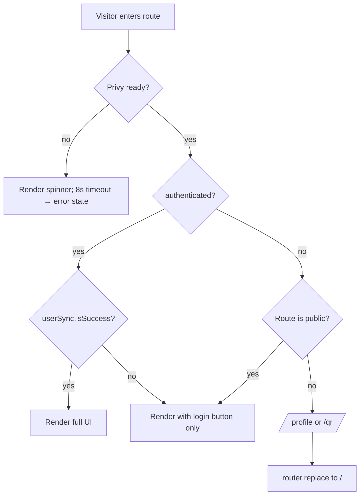

# refactor: Marketplace-First App Refactor

## Overview

Pivot the Wealth Redemption frontend from **login-first** (every route gated by `AuthGuard`) to **marketplace-first** (anonymous browse, login on-demand). Concurrently consolidate navigation (drop bottom nav, dual-state header), merge wallet + history into a scrollable Profile page, ship Withdraw, introduce shadcn/ui as the new component foundation, and convert public marketplace pages to server-rendered shells with SEO metadata.

Stack stays Next.js 16 (App Router); the brainstorm's mention of Vite is dropped per user decision (see origin: `docs/brainstorms/2026-05-07-marketplace-first-refactor-requirements.md`). All changes are frontend-only — no backend route additions, no DB migrations.

## Problem Frame

The login-first model walls off the marketplace from anonymous visitors and search engines, increases time-to-first-redemption for new users (browse → login → deposit → redeem becomes login → wait → browse → redeem), and concentrates navigation surface (`/wallet`, `/history`, `/onboarding/deposit`, bottom nav) on UI shell components that haven't earned their complexity. Existing components carry Material-style tokens that fight the planned wealthcrypto.fund aesthetic, and there's no SSR/metadata story for the public surface.

This refactor delivers the marketplace pivot, consolidates the navigation, ships Withdraw (a previously-deferred wallet primitive), establishes shadcn as the component library going forward, and lays SSR + metadata foundation for SEO — all without backend dependencies.

## Requirements Trace

Source requirements doc: `docs/brainstorms/2026-05-07-marketplace-first-refactor-requirements.md` (R1–R33).

- **Auth & Routing (R1–R7):** Drop `AuthGuard`, build `useRequireAuth`, drop `/auth/login`, `/wallet`, `/onboarding/deposit`, `/history` routes, relocate `useSyncUser` to a gated global effect.
- **Header & Navigation (R8–R11):** Dual-state `MobileHeader`, prune `Sidebar`, drop `BottomNav`, build shared `HeaderAuthControls`.
- **Onboarding (R12–R15):** True new-user welcome sheet (gated on `isSuccess` of both balance + redemptions queries), home deposit CTA card while balance is zero.
- **Profile Page (R16–R21):** Single scrollable page with Balance Card, Deposit + Withdraw modals, Withdraw form with gas pre-flight, dynamic `targetChain.name` wrong-chain label, success state as v1 system-of-record for withdraw.
- **Transaction History v1 (R22–R27):** Redemption-only data source with new presentation (`TxHistoryTable` desktop + `TxHistoryCardList` mobile), `TxDetailModal`, normalized `HistoryEntry` shape future-ready for transactions endpoint.
- **Voucher Detail Redeem Button (R28–R30):** 4-state precedence (unauth → wrong-chain → insufficient → redeem), button-flip gated on `useSyncUser.isSuccess`, `useRedeemVoucher` entry guard added.
- **SEO (R31–R33):** `generateMetadata` + SSR shells for public routes, `app/sitemap.ts` excluding expired vouchers, `app/robots.ts` disallowing private surfaces.

Success criteria from origin doc are inherited verbatim.

## Scope Boundaries

**In scope:**

- All R1–R33 from the origin requirements doc.
- shadcn/ui introduction with Tailwind v4 token coexistence layer.
- Server-component conversion of public pages with TanStack Query SSR via `HydrationBoundary`.
- Aesthetic polish (color palette, font, spacing iterations) is _post-functional_ — applied as the final phase after all R1–R33 land.

**Out of scope (explicit non-goals):**

- Vite migration (deferred indefinitely; we keep Next.js 16).
- `useRedeemVoucher` god-hook split (separate ticket; this plan only adds an `authenticated` early-return).
- Backend changes of any kind: no new endpoints, no schema migrations, no Hono middleware tweaks. Withdraw rows in tx history await a future BE indexer ticket.
- Privy / wagmi / `viem` SDK upgrades.
- API client (`lib/api/client.ts`, `endpoints.ts`) and Zod schemas for existing endpoints — preserved as-is.
- Zustand `redemption-flow` store — preserved.
- ERC-20 ABI — preserved.
- DOM/component testing infrastructure (`jsdom`, `@testing-library/react`) — accepted limitation; only pure-function tests added in this refactor.
- Cross-device welcome-shown state, ENS resolution / address book for withdraw, dynamic OG image generation, preserve-intent redirect for `/qr/[id]` shared links, dark mode — all explicitly accepted limitations or out-of-scope per origin doc.

## Context & Research

### Relevant Code and Patterns

- **Provider stack** (`src/providers.tsx`, `"use client"`): `PrivyProvider` → `QueryClientProvider` → `WagmiProvider` (from `@privy-io/wagmi`) → `AccessTokenBridge` + children. Order is critical and preserved.
- **Auth pipeline:** `src/components/layout/auth-guard.tsx` (target for R1 deletion) currently fires `useSyncUser` once via `useRef`. `src/hooks/use-auth.ts` exposes `{ user, authenticated, ready, sendCode, loginWithCode, logout, email, walletAddress }` but does NOT expose `login` from `usePrivy()` — must extend (R8 trigger). `src/hooks/use-sync-user.ts` is a thin `useMutation` wrapper, dedupe is currently ref-based outside the hook.
- **API client auth boundary:** `src/lib/api/client.ts` calls the registered access-token getter only when `requireAuth: true`. Public endpoints in `src/lib/api/endpoints.ts` (`listCategories`, `listMerchants`, `getMerchant`, `listVouchers`, `getVoucher`, `getWealthPrice`) already pass `requireAuth: false` — anonymous SSR fetches work at the FE contract layer with no client.ts change.
- **On-chain pattern to mirror:** `src/hooks/use-redeem-voucher.ts:27-37` `isUserReject` (handles `instanceof UserRejectedRequestError`, EIP-1193 `code === 4001`, name match, regex fallback). `:96-102` shows the `writeContractAsync({ address, abi: ERC20_ABI, functionName: "transfer", args: [recipient, parsed] })` shape `useWithdraw` mirrors. ABI at `src/lib/erc20-abi.ts`. Token address from `env.NEXT_PUBLIC_TOKEN_CONTRACT_ADDRESS` (validated in `src/lib/env.ts`).
- **Wrong-chain reference:** `src/app/(main)/vouchers/[id]/page.tsx:182` already renders `Pindah ke {targetChain.name} (chain ID {TARGET_CHAIN_ID})`. `targetChain` from `src/lib/wagmi.ts` — toggles `mainnet` vs `sepolia` from `NEXT_PUBLIC_CHAIN`.
- **Existing Modal primitive:** `src/components/shared/modal.tsx` — hand-rolled, no portal, only used by `signing-state-ui.tsx`. New modals/sheets use shadcn primitives instead; preserve existing `Modal` until `SigningStateUI` migrates (out of scope).
- **Form precedent:** Only one form exists today (`src/app/auth/login/page.tsx`, useState + try/catch). Being deleted in R3. New convention via shadcn `Form` (react-hook-form + Zod).
- **Tailwind tokens already partially aliased** in `src/app/globals.css:54-67` — Material-style `--color-on-surface`-style tokens mapped to shadcn names (`--color-background`, `--color-foreground`, `--color-card`, `--color-muted`, `--color-accent`, `--color-destructive`, `--color-border`, `--color-input`, `--color-ring`). Missing: `--popover{,-foreground}`, `--secondary{,-foreground}`, chart/sidebar tokens. Coexistence strategy: extend the alias map, don't rip out Material tokens.
- **Env validation:** `src/lib/env.ts` uses Zod `min(1)` on `NEXT_PUBLIC_PRIVY_APP_ID`. CI does not set it; tests work around via `vi.stubEnv` before module import.
- **TS strictness flags:** `noUncheckedIndexedAccess`, `exactOptionalPropertyTypes`, `noImplicitOverride` — be careful passing `value: undefined` for optional props (must omit), and array indexes are `T | undefined`.
- **CSP** in `next.config.ts:29-42`: tightly constrained, but shadcn install adds no remote origins. Etherscan link previews are browser-only navigation — no CSP change.
- **Knip** entries cover routes + providers; deleting routes will surface dead helpers (`src/lib/auth-errors.ts`, `src/hooks/use-transactions.ts`, `src/components/layout/{auth-guard,bottom-nav}.tsx`). Run `pnpm exec knip` after route deletion.
- **Husky + lint-staged:** ESLint --fix + Prettier on `*.{ts,tsx,...}` pre-commit. shadcn-generated files commit already-formatted.
- **Test conventions:** `vitest.config.ts` uses `environment: "node"`, `include: ["src/**/__tests__/**/*.test.ts"]` (only `.test.ts`, not `.tsx`, only inside `__tests__/`). Fixtures inlined per-file. No `setupFiles`. Mock pattern: `vi.stubEnv` for env vars, `vi.spyOn(globalThis, "fetch")` for HTTP. See `src/lib/api/__tests__/endpoints.test.ts` for canonical shape.

### Institutional Learnings

`docs/solutions/` does **not exist** in this repo or its sibling backends. The closest prior knowledge:

- `docs/analysis/04-auth-flow.md` — Privy JWT, no app-side session, `AccessTokenBridge` glue.
- `docs/analysis/07-wallet-blockchain.md` — `writeContractAsync` shape, `parseUnits(amount, 18)` hardcode (acceptable inheritance for Withdraw), no built-in network switcher (we keep that pattern; disabled CTA only).
- `docs/analysis/10-pain-points.md` — P5 (no balance check before signing) is the issue Withdraw R19 explicitly addresses with the gas pre-flight.
- `docs/analysis/11-refactor-readiness.md` — confirms preserve vs rebuild lists; flags shadcn token mapping as the highest-friction surface.

### External References

Verified version-specific guidance gathered for this plan:

- **Next.js 16 + TanStack Query SSR (HydrationBoundary):** TanStack v5 Advanced SSR guide. Pattern: `getQueryClient()` factory branching on `isServer`, module-level browser singleton, `dehydrate` + `<HydrationBoundary>` per server-component page. `'pending'` query state included via `defaultOptions.dehydrate.shouldDehydrateQuery`.
- **Next.js 16 `generateMetadata`:** Server-component only, `params` is `Promise`, `fetch` auto-memoized across `generateMetadata` + page; `cache()` from React for non-`fetch` data (we wrap `apiRequest` callsites).
- **shadcn/ui with Tailwind v4 (CLI 2.x, 2026):** `new-york` style, OKLCH color values, `tw-animate-css` replaces `tailwindcss-animate`, `data-slot` attribute on every primitive, `forwardRef` removed (function components with plain `ref` typing). `:root` holds raw values, `@theme inline` exports them under `--color-*`. CLI auto-installs Radix sub-packages + `class-variance-authority` + `clsx` + `tailwind-merge` + `lucide-react` on `init`.
- **Privy + Next App Router:** `PrivyProvider` is client-only. `usePrivy().login()` opens the native modal in-page — what we want. For login lifecycle callbacks use `useLogin({ onComplete, onError })` (alternative entry; not needed for our scope).
- **wagmi 3.x error typing:** `BaseError.walk(predicate)` from viem walks the cause chain, useful for nested `UserRejectedRequestError` wrapping by Privy's connector. `InsufficientFundsError` and `ContractFunctionRevertedError` discoverable via `walk`.
- **Sitemap with paginated APIs:** `app/sitemap.ts` route handler, default cached. `revalidate = 3600` controls regen cadence. `generateSitemaps` only needed beyond 50,000 URLs (we're nowhere near that).

## Key Technical Decisions

- **Stay on Next.js 16, drop the Vite plan** (origin: user decision). Preserves existing infra; SEO via Next's metadata API + SSR is cheap.
- **Introduce shadcn alongside Material-style tokens (alias coexistence) rather than full token migration.** The alias scaffolding at `globals.css:54-67` already started; we extend it. Existing components keep referencing Material names (`bg-surface-container`, `text-on-surface-variant`); new shadcn primitives reference shadcn names (`bg-background`, `text-foreground`). Avoids touching every existing component while delivering the new component library.
- **Welcome trigger gates on `isSuccess` of both `useWealthBalance` and `useRedemptions`.** Treat unresolved/loading as no-trigger to prevent flicker for users mid-balance-load (origin: autofix from document review). Independent `useQuery` + derived flag pattern (Option A from research), not `useQueries.combine`.
- **`useSyncUser` lives in a new `<UserSyncBridge />` client component** mounted inside `<Providers>` as sibling to `<AccessTokenBridge />`. Dedupe key is Privy `userId`, reset when `authenticated` flips false. Avoids SSR boundary issues that putting it in `(main)/layout.tsx` would create now that the layout is public.
- **Tx history v1 = redemption-only** (origin: BE indexer absent). Withdraw rows come later via unified `/api/transactions` once BE catches up. The normalized `HistoryEntry` shape is defined now so the v2 swap is a minor change.
- **Withdraw success state IS the v1 system of record.** Inline txHash + Etherscan link + close button. No localStorage cache stop-gap (origin: user accepted scope; document review surfaced this as P0 trade-off but user chose to ship as-is). Plan adds copy emphasis ("Catat txHash sebelum tutup modal") to mitigate the audit-trail risk.
- **Dynamic `targetChain.name` everywhere wrong-chain copy appears** (origin: R21). No hardcoded "Ethereum" string.
- **Shadcn `Form` (react-hook-form + Zod resolver) for `WithdrawForm`** establishes the new form convention. Existing useState-based login form is being deleted, so there's no inconsistency to manage.
- **Pure-function tests only.** No DOM testing infrastructure added; tests are limited to Zod schemas and predicate functions extracted from hooks. Component-level coverage deferred — accepted limitation. (See risks.)
- **Server-component conversion uses isomorphic `getQueryClient()`** factory at `src/lib/get-query-client.ts`. `Providers` component continues to host the browser singleton; server components call the factory directly.
- **Voucher detail post-login button-flip gates on `useSyncUser.isSuccess`** in addition to `authenticated`. Prevents premature label flip to "Redeem" before BE handshake completes — eliminates a 401 race window.

## Open Questions

### Resolved During Planning

- **shadcn token coexistence:** extend the alias map, keep Material tokens. Resolved via repo-research-analyst's reading of `globals.css:54-67`.
- **`useSyncUser` location:** new `<UserSyncBridge />` inside Providers. Resolved via SSR boundary analysis.
- **Welcome trigger order:** independent `useQuery` + `isSuccess` derived. Resolved via TanStack Query 5 docs (Option A simpler than `useQueries.combine` for two queries with side-effect outcome).
- **wagmi error helper home:** `src/lib/wallet-errors.ts` with `BaseError.walk()` enhancement. Resolved via viem error handling docs.
- **Form library for Withdraw:** shadcn `Form` (react-hook-form). Resolved via shadcn `Form` docs (auto-installs `react-hook-form` + `@hookform/resolvers`).
- **Login modal trigger:** `usePrivy().login()` exposed via `useAuth` extension. Resolved via Privy v3 React quickstart.
- **Test surface scope:** pure-function tests only. Resolved via vitest config inspection (no jsdom).
- **OG fallback image:** use `/public/image/w-logo.png` as static fallback for v1 (1024×1024); flag in deferred items as a candidate to replace with proper 1200×630 asset.

### Resolve Before Phase D (added by document review)

- **`useSyncUser` cross-component sharing primitive.** `useSyncUser` is implemented as `useMutation`, so reading `.isSuccess` from a separate `useSyncUser()` call in voucher detail (Unit 8) returns the page's local mutation state, not the bridge's. Three options: (a) convert `useSyncUser` from `useMutation` to `useQuery({ enabled: ready && authenticated, queryKey: ['user-sync', userId] })` so any consumer reads the same cache; (b) add a `mutationKey: ['sync-user']` to the mutation and have voucher detail read via `useMutationState({ filters: { mutationKey: ['sync-user'] } })`; (c) add a small Zustand atom that `<UserSyncBridge />` writes on success, voucher detail reads. **Pick before Unit 8 implementation.** Recommended: (c) — minimal blast radius, mirrors the existing `redemption-flow` Zustand pattern.

### Deferred to Implementation

- Exact prop shape of new shadcn primitive consumers (Dialog, DropdownMenu, Sheet, AlertDialog) — auto-generated by `npx shadcn add`; minor TS/`exactOptionalPropertyTypes` adjustments may be needed at consumption sites.
- Whether `useSyncUser` BE endpoint is truly idempotent under rapid re-mount or not — verify in BE during implementation; if not, add retry/dedupe at hook level. Surfaced by document review as P3.
- Final list of CSS variables added to `:root` for shadcn neutrality if dark mode is later added — keep names in `:root`, only add `.dark` block when the polish phase needs it.
- Whether the existing `BalanceCard` component (`src/components/features/balance-card.tsx`) is refactored or replaced — depends on shadcn `Card` ergonomics post-install.
- `useRequireAuth` timeout consumer contract: profile + qr both render `<TimeoutErrorState onReload={() => window.location.reload()} />` for the `timeout` status — full-page reload to re-init Privy. Confirm during Unit 5 implementation.
- TxHistoryTable search scope: `Search filters client-side across loaded pages only.` If `hasNextPage` is true while search is active, render a small note: "Memuat lebih banyak mungkin mengungkap hasil lainnya."
- TxDetailModal "View QR" button: only render when `entry.kind === "redeem"` AND `entry.status` is `"pending"` or `"confirmed"` AND `entry.redemptionId` is defined. Hide for terminal states.
- HomeDepositCta loading-state policy: hide the section entirely while `balanceQuery.isLoading` (don't render skeleton) — only mount the Card after `balanceQuery.isSuccess && rawBalance === 0n`. Avoids the section appearing then disappearing for users with positive balance.
- Header chain status indicator: drop the green dot + chain name from `MobileHeader` (the wrong-chain banner on voucher detail is now the only signal). If retained, place as a small badge inside `HeaderAuthControls` avatar.

## High-Level Technical Design

> _This illustrates the intended approach and is directional guidance for review, not implementation specification. The implementing agent should treat it as context, not code to reproduce._

### Auth surface state machine



### Data prefetch sketch for public marketplace pages (R32)

Server component shell:

```
// app/(main)/page.tsx — Server Component (no "use client")
const queryClient = getQueryClient();
await queryClient.prefetchQuery({ queryKey: queryKeys.merchants(...), queryFn: () => endpoints.listMerchants(...) });
await queryClient.prefetchQuery({ queryKey: queryKeys.priceWealth, queryFn: () => endpoints.getWealthPrice() });
return (
  <HydrationBoundary state={dehydrate(queryClient)}>
    <HomeInteractive />   // "use client", calls useQuery with same keys
  </HydrationBoundary>
);
```

`generateMetadata` for `/vouchers/[id]` shares the same `cache()`-wrapped fetcher as the page so the request runs once.

### Voucher Detail Redeem button decision matrix (R28)

| Auth               | Chain | Balance | Label                             | onClick                                             | Disabled |
| ------------------ | ----- | ------- | --------------------------------- | --------------------------------------------------- | -------- |
| no                 | n/a   | n/a     | "Login untuk Redeem"              | `usePrivy().login()`                                | no       |
| yes (sync done)    | wrong | any     | `"Pindah ke ${targetChain.name}"` | —                                                   | yes      |
| yes (sync done)    | right | < price | "Saldo Tidak Cukup, Deposit"      | open `DepositModal`                                 | no       |
| yes (sync done)    | right | ≥ price | "Redeem Voucher"                  | `useRedeemVoucher().start(id)`                      | no       |
| yes (sync pending) | any   | any     | "Login untuk Redeem"              | `usePrivy().login()` (no-op if modal closes itself) | no       |

Precedence: unauth → wrong-chain → insufficient → redeem.

## Implementation Units

### Phase A — Foundation (must land first)

- [ ] **Unit 1: shadcn install, token aliasing, query client, wallet-errors lib**

**Goal:** Land the shadcn/ui foundation, isomorphic `getQueryClient()`, and shared wallet-error helpers — the prerequisites every subsequent unit depends on. No user-visible change yet.

**Requirements:** Foundation for R12, R15, R17–R26, R31–R32. Origin doc Deferred Q "shadcn/ui setup" + "Pattern resolved wagmi error".

**Dependencies:** None.

**Files:**

- Create: `components.json`, `src/components/ui/` (populated by shadcn CLI: `dialog.tsx`, `dropdown-menu.tsx`, `sheet.tsx`, `alert-dialog.tsx`, `form.tsx`, `input.tsx`, `button.tsx`, `table.tsx`, `card.tsx`, `badge.tsx`, `skeleton.tsx`, `label.tsx`)
- Create: `src/lib/get-query-client.ts` (isomorphic factory)
- Create: `src/lib/wallet-errors.ts` (`isUserReject`, `isInsufficientFunds`, `isContractRevert` with `BaseError.walk()`)
- Modify: `src/app/globals.css` (existing file uses Tailwind v4 `@theme {}` block exclusively — there is NO `:root` block today, and `--color-card`, `--color-card-foreground`, and `--color-secondary` already exist at lines 22–25, 56–67. Concrete merge: (1) introduce a `:root { --background: oklch(...); --foreground: ...; --primary: ...; --popover: ...; --popover-foreground: ...; ... }` block for the missing shadcn raw values, (2) add `@theme inline { --color-background: var(--background); --color-foreground: var(--foreground); --color-popover: var(--popover); --color-popover-foreground: var(--popover-foreground); ... }` to expose them as Tailwind utilities, (3) keep the existing `@theme {}` block of Material-style tokens untouched. Don't re-add tokens that already exist (`--color-card`, `--color-secondary`, `--color-secondary-container`, `--color-on-secondary`).)
- Modify: `src/providers.tsx` (replace `useState(() => new QueryClient(...))` with `getQueryClient()`)
- Modify: `src/hooks/use-wealth-balance.ts` (forward `isSuccess` and `isError` from underlying `useReadContract` — needed for Unit 9 welcome-trigger gating)
- Modify: `package.json` + `pnpm-lock.yaml` (Radix primitives, `class-variance-authority`, `clsx`, `tailwind-merge`, `tw-animate-css`, `lucide-react`, `react-hook-form`, `@hookform/resolvers` — all auto-added by shadcn CLI except react-hook-form which `Form` requires)
- Test: `src/lib/__tests__/wallet-errors.test.ts`

**Approach:**

1. Run `pnpm dlx shadcn@latest init` with `new-york` style, baseColor neutral, CSS variables yes. Diff and merge `globals.css` — keep Material tokens, accept shadcn additions.
2. Run `pnpm dlx shadcn@latest add dialog dropdown-menu sheet alert-dialog form input button table card badge skeleton label`. Generated files land in `src/components/ui/`.
3. Manually install `react-hook-form @hookform/resolvers` (shadcn `Form` depends on these but CLI doesn't always auto-install).
4. Build `src/lib/get-query-client.ts` with `isServer` branching, module-level browser singleton, `staleTime: 60_000`, `retry: 1`, `refetchOnWindowFocus: false` (preserve current Providers defaults), `dehydrate.shouldDehydrateQuery` includes `'pending'`.
5. Refactor `src/providers.tsx` to import `getQueryClient` and call it directly. Provider order unchanged.
6. Lift `isUserReject` from `src/hooks/use-redeem-voucher.ts:27-37` into `src/lib/wallet-errors.ts`. Add `BaseError.walk()` enhancement to catch nested rejections. Add `isInsufficientFunds(err)` and `isContractRevert(err)` helpers used by `useWithdraw` (Unit 6).
7. Update `use-redeem-voucher.ts` import to use the lifted helper (zero behavior change).
8. Run `pnpm typecheck && pnpm lint && pnpm test:ci` to confirm green.

**Patterns to follow:**

- shadcn CLI defaults (don't override unless necessary): `style: new-york`, `baseColor: neutral`, `cssVariables: true`.
- Existing `globals.css` `@theme` block structure (Tailwind v4 CSS-first config).
- Existing `src/lib/erc20-abi.ts` minimal-ABI style for any wallet helpers.

**Test scenarios:**

- Happy path — `isUserReject` returns `true` for: `instanceof UserRejectedRequestError`, `{ code: 4001 }`, `{ name: "UserRejectedRequestError" }`, `{ message: "User rejected the request" }`, and a `BaseError` whose `.walk()` finds a nested `UserRejectedRequestError`.
- Edge case — `isUserReject` returns `false` for: generic `Error`, `null`, `undefined`, `{}`, an unrelated viem error (e.g., `ContractFunctionRevertedError`).
- Happy path — `isInsufficientFunds` returns `true` for a `BaseError` chain containing `{ name: "InsufficientFundsError" }`; `false` for unrelated errors.
- Edge case — `isContractRevert` returns `{ reverted: true, reason: "..."}` when chain contains `ContractFunctionRevertedError` with reason; `{ reverted: true, reason: undefined }` when reason absent; `{ reverted: false }` when no revert in chain.
- Edge case — `getQueryClient` returns the same instance on repeated client-side calls (`window` defined), but a fresh instance per call when `window` undefined. Use `vi.stubGlobal("window", ...)` to flip.

**Verification:**

- `pnpm typecheck` clean.
- `pnpm test:ci` clean (new `wallet-errors.test.ts` suite green).
- `pnpm exec next build` succeeds, no new bundle bloat warnings beyond shadcn additions.
- Existing redemption flow still works manually (sanity check that the lifted error helper didn't break `use-redeem-voucher`).

---

- [ ] **Unit 2: Auth pattern overhaul — useAuth extension, useRequireAuth, UserSyncBridge**

**Goal:** Build the new auth primitives (`useRequireAuth` hook, `<UserSyncBridge />`), extend `useAuth` with Privy `login`, and prepare the layout for AuthGuard removal (which lands in Unit 3 alongside route deletion).

**Requirements:** R2, R7, R8 (login trigger), R29 (button-flip gating).

**Dependencies:** Unit 1.

**Files:**

- Modify: `src/hooks/use-auth.ts` (add `login` from `usePrivy()`, remove `sendCode`/`loginWithCode` references — those are tied to login route deletion in Unit 3, so leave them in place but mark for removal)
- Create: `src/hooks/use-require-auth.ts`
- Create: `src/components/layout/user-sync-bridge.tsx`
- Modify: `src/providers.tsx` (mount `<UserSyncBridge />` next to `<AccessTokenBridge />`)
- Test: `src/hooks/__tests__/use-require-auth.test.ts` (pure-logic-only — no DOM rendering; test decision predicate extracted from the hook)

**Approach:**

1. Extend `src/hooks/use-auth.ts`: destructure `login` from `usePrivy()` and add to return shape. Keep existing return keys for now (login route still exists until Unit 3).
2. Build `useRequireAuth()`: returns `{ status: "loading" | "authenticated" | "redirecting" | "timeout" }` with internal `useEffect` + `setTimeout(8000)` for the timeout fallback. When `ready && !authenticated`, call `router.replace("/")`. Don't render anything itself — leave UI to consumer (return status, consumer renders spinner/error).
3. Build `<UserSyncBridge />`: client component, no DOM output. `useEffect` keyed on `[ready, authenticated, user?.id]`. When transitioning to `ready && authenticated && userId !== lastSyncedUserId.current`, call `syncUser()` and update ref. When `!authenticated`, reset `lastSyncedUserId.current = null`.
4. Update `src/providers.tsx`: render `<UserSyncBridge />` inside `<WagmiProvider>` next to `<AccessTokenBridge />`. Both bridges are siblings.
5. Do NOT yet remove `<AuthGuard>` from `src/app/(main)/layout.tsx` — Unit 3 owns that to keep this unit small.

**Execution note:** Defensive split — landing useAuth/useRequireAuth/UserSyncBridge in their own commit makes the diff easier to review than bundling with route deletion.

**Patterns to follow:**

- `src/components/layout/access-token-bridge.tsx` shape (client component, no DOM, registers something into a global lifecycle).
- `useRef` dedupe pattern from existing `auth-guard.tsx:18`.
- TanStack Query mutation usage from `src/hooks/use-sync-user.ts`.

**Test scenarios:**

- Happy path — pure helper extracted from `useRequireAuth` returns "authenticated" when `{ ready: true, authenticated: true }`, "redirecting" when `{ ready: true, authenticated: false }`, "loading" when `{ ready: false, authenticated: false, elapsedMs: 0 }`, "timeout" when `{ ready: false, elapsedMs: 8001 }`.
- Edge case — when `ready: true, authenticated: true` is reached, subsequent ticks remain "authenticated" (no flicker back to "redirecting").
- Edge case — UserSyncBridge dedupe predicate returns `true` (should sync) only when `(ready && authenticated && userId !== lastSyncedUserId)`; returns `false` for all other input combinations including `authenticated && userId === lastSyncedUserId` and `!authenticated`.

**Verification:**

- `pnpm typecheck` clean.
- New tests green.
- Existing app still routes through `AuthGuard` (Unit 2 doesn't remove it yet) — login flow unchanged for users.

---

### Phase B — Routes cleanup and navigation

- [ ] **Unit 3: Drop legacy routes + AuthGuard, prune layout, fix home page**

**Goal:** Delete `/auth/login`, `/(main)/wallet`, `/(main)/onboarding/deposit`, `/(main)/history`. Remove `<AuthGuard>` from `(main)/layout.tsx`, drop `<BottomNav>`. Fix home page to remove balance-zero redirect logic. Run knip and clean dead code.

**Requirements:** R1, R3, R4, R5, R6, R10. Also de-couples Home page from forced onboarding redirect.

**Dependencies:** Unit 2 (so `useRequireAuth` exists for `/profile` and `/qr/[id]` to use later).

**Files:**

- Delete: `src/app/auth/` (entire subtree, including `auth/login/page.tsx`)
- Delete: `src/app/(main)/wallet/`
- Delete: `src/app/(main)/onboarding/`
- Delete: `src/app/(main)/history/`
- Delete: `src/components/layout/auth-guard.tsx`
- Delete: `src/components/layout/bottom-nav.tsx`
- Delete: `src/lib/auth-errors.ts` (knip-flagged: only consumer was login page)
- Delete: `src/hooks/use-transactions.ts` (only consumer was wallet page; not used in v1 tx history per R22). Also delete `src/lib/schemas/transaction.ts` — no remaining consumer in scope; will be re-derived when BE indexer ticket lands.
- Modify: `src/app/(main)/layout.tsx` (remove `<AuthGuard>` wrapper, remove `<BottomNav>`, simplify shell)
- Modify: `src/app/(main)/page.tsx` (remove `localStorage["onboarding-deposit-dismissed"]` redirect to `/onboarding/deposit`; remove balance-zero redirects; keep public-readable home)
- Modify: `src/app/(main)/qr/[redemptionId]/page.tsx` (add `useRequireAuth()` at page top — single-line guard so the route stays protected after layout-level AuthGuard is removed, no window of unprotected access)
- Modify: `src/components/shared/quick-action-chips.tsx` (remove or repoint Deposit/Riwayat entries — `/wallet` and `/history` no longer exist; Deposit can defer until Unit 5 lands `DepositModal` or simply remove the chip in this commit)
- Modify: `src/components/layout/sidebar.tsx` (drop the `/wallet` nav item too, not only History — both routes are deleted in this unit)
- Modify: `src/hooks/use-redeem-voucher.ts` (replace the `router.push("/auth/login")` 401 redirect on line ~183 with `usePrivy().login()` — the route no longer exists)
- Modify: `src/hooks/use-auth.ts` (remove `sendCode`, `loginWithCode` from return; remove `useLoginWithEmail` import)
- Modify: `next.config.ts` (add required `redirects()` block: `/wallet → /profile` (308), `/history → /profile` (308), `/auth/login → /` (308), `/onboarding/deposit → /` (308) — eliminates the bookmark-404 class for existing users)

**Approach:**

1. Delete files and directories in the order: leaf routes first (`auth/login`, `wallet`, `onboarding/deposit`, `history`), then layout components (`auth-guard`, `bottom-nav`), then dead helpers (`auth-errors`, `use-transactions`).
2. Update `(main)/layout.tsx` to render `<Sidebar /> + (<MobileHeader /> + <main>{children}</main>) + <OfflineBanner />` only — no AuthGuard, no BottomNav.
3. Update home page (`(main)/page.tsx`): remove the redirect block at the top, render hero + featured vouchers unconditionally for both auth and unauth.
4. Update `useAuth` to drop OTP-related exports (everything tied to `useLoginWithEmail`).
5. Run `pnpm exec knip` — confirm no regressions, clean any newly-flagged dead code.
6. Verify all routes still resolve: `/`, `/merchants`, `/merchants/[some-id]`, `/vouchers/[some-id]` are public; `/profile` and `/qr/[some-id]` redirect to `/` via the page-level `useRequireAuth` (added in this unit for `/qr/[redemptionId]` and in Unit 5 for `/profile`).

**Note on `/qr/[redemptionId]` and `/profile` guard:** Unit 3 deletes the layout-level guard. To prevent a window of unprotected access, this unit adds `useRequireAuth` to `/qr/[redemptionId]/page.tsx` directly (one-line addition at page top). `/profile` keeps its current page (no auth read yet) until Unit 5 rewrites it; the existing profile page is harmless without auth (only renders email/wallet placeholders) but Unit 5 should land within the same release window.

**Patterns to follow:**

- Existing `(main)/layout.tsx` structure (just remove the AuthGuard wrapper and BottomNav element).
- Conventional commit style for the deletion commit (`refactor: drop legacy login/wallet/history/onboarding routes`).

**Test scenarios:**

- No new test files. Existing tests must remain green; specifically `endpoints.test.ts` doesn't depend on any of the deleted modules.

**Verification:**

- `pnpm exec knip` reports zero regressions (any newly-flagged items are cleaned in the same commit).
- `pnpm lint && pnpm typecheck && pnpm test:ci` all green.
- `pnpm exec next build` succeeds.
- Manual smoke: `/` loads as anonymous user without redirect; `/merchants` loads; `/wallet`, `/history`, `/onboarding/deposit`, `/auth/login` all 308 to their replacements (no 404 for old bookmarks); `/profile` and `/qr/[id]` redirect to `/` for unauth users.

---

- [ ] **Unit 4: Header + Navigation refactor**

**Goal:** Build `HeaderAuthControls` (login button when unauth, avatar dropdown when auth). Update `MobileHeader` and `Sidebar` to consume it. Drop sidebar History menu and conditional Profile link.

**Requirements:** R8, R9, R11.

**Dependencies:** Unit 1 (shadcn DropdownMenu + Button), Unit 2 (extended `useAuth` with `login`).

**Files:**

- Create: `src/components/layout/header-auth-controls.tsx` (uses `useAuth`, shadcn `DropdownMenu` + `Button` + `Avatar` if added — else simple `<button>` rendering initials). **Gate first render on `ready === true`**: while `!ready`, render a small `Skeleton` placeholder of the same width as the Login button to prevent SSR↔client hydration mismatch (Privy state is only known client-side).
- Modify: `src/components/layout/mobile-header.tsx` (replace any auth UI with `<HeaderAuthControls />`; ensure logo links to `/`, add `/merchants` link)
- Modify: `src/components/layout/sidebar.tsx` (drop History nav item; conditionally render Profile link only when `authenticated`; mount `<HeaderAuthControls />` at the bottom-right of sidebar header)

**Approach:**

1. Build `HeaderAuthControls`: branches on `useAuth().authenticated`. Unauth → `<Button onClick={login} variant="default">Masuk</Button>`. Auth → `<DropdownMenu>` with avatar trigger (shadcn `Avatar` + initials fallback) and items "Profile" → `router.push('/profile')`, "Logout" → `logout()`.
2. Update `MobileHeader` to a clean three-region layout: logo (left) → optional section nav links (`/`, `/merchants` text links visible on mobile) → `<HeaderAuthControls />` (right). Drop redundant home/merchants discovery via dropdown.
3. Update `Sidebar`: remove the History nav item from the nav list; gate Profile nav item on `authenticated`; mount `<HeaderAuthControls />` near sidebar top-right.

**Patterns to follow:**

- shadcn `DropdownMenu` example from generated `src/components/ui/dropdown-menu.tsx` doc comments.
- Existing tailwind class composition in `mobile-header.tsx` for spacing/typography.
- `next/link` for in-app navigation (matches existing pattern).

**Test scenarios:**

- Test expectation: none — pure presentation component, no DOM testing infra. Behavior is exercised by Unit 5/Unit 8 manual smokes.

**Verification:**

- Visual: header on mobile + desktop shows correct state for unauth and auth users.
- Click "Masuk" → Privy native modal opens.
- Click avatar → dropdown shows Profile + Logout; clicking Profile navigates; clicking Logout signs out and rerenders header to "Masuk".
- `pnpm typecheck && pnpm lint` green.

---

### Phase C — Profile page + wallet primitives

- [ ] **Unit 5: Profile page scaffold + Balance Card + Deposit Modal**

**Goal:** Rewrite `/profile` as a scrollable single page guarded by `useRequireAuth`. Extract a balance card with Deposit/Withdraw buttons. Build `DepositModal` by porting `WalletDepositPanel` content into a shadcn `Dialog`.

**Requirements:** R2, R16, R17, R18.

**Dependencies:** Unit 1 (shadcn `Dialog`, `Card`, `Button`), Unit 2 (`useRequireAuth`).

**Files:**

- Modify: `src/app/(main)/profile/page.tsx` (full rewrite — sections: Balance Card, Tx History placeholder, Account Info, Logout)
- Modify or replace: `src/components/features/balance-card.tsx` (port to shadcn `Card`; expose Deposit/Withdraw buttons)
- Create: `src/components/features/deposit-modal.tsx` (shadcn `Dialog` wrapping `WalletDepositPanel` content)
- Modify: `src/components/features/wallet-deposit-panel.tsx` (extract content as a content component; remove the `Modal`-based wrapper if any)

**Approach:**

1. Profile page: at top, call `useRequireAuth()`; render branch on returned status (loading → spinner; timeout → error block with reload; redirecting → null; authenticated → main content).
2. Section order on the page: Balance Card → Tx History (placeholder section, fully wired in Unit 7) → Account Info (port email + wallet address from current page) → Logout button.
3. `BalanceCard`: shadcn `Card` with WEALTH balance via `useWealthBalance`, IDR equivalent via `usePrice`, two buttons: "Deposit" opens `DepositModal`, "Withdraw" opens `WithdrawModal` (Unit 6 lands the modal — for now stub as console.log + TODO).
4. `DepositModal`: shadcn `Dialog`. Content = step-by-step guide + embedded wallet address `<CopyableAddress>` + contract address copy + network reminder. Reuse `WalletDepositPanel` content sub-component.
5. Tx History placeholder: empty section with "Memuat..." text — Unit 7 wires it up.

**Patterns to follow:**

- Existing `src/app/(main)/profile/page.tsx` for email/wallet copy strings.
- `src/components/features/wallet-deposit-panel.tsx` for deposit guide UI — extract its content sub-tree.
- `CopyableAddress` from `src/components/shared/copyable-address.tsx` for address copy buttons.

**Test scenarios:**

- Test expectation: none — DOM-bound, no test infra. Manual smoke covers the verification.

**Verification:**

- `/profile` while unauth → redirect to `/`.
- `/profile` while auth → renders Balance Card with current balance + IDR; clicking Deposit opens shadcn dialog with guide; closing dialog returns to profile cleanly.
- Spinner shows while `useRequireAuth` is loading; 8s timeout produces error state.
- `pnpm typecheck && pnpm lint && pnpm test:ci` green.

---

- [ ] **Unit 6: Withdraw form + modal + hook + gas pre-flight**

**Goal:** Ship the Withdraw feature. Schema-validated form (amount + address + Max button), gas pre-flight check, AlertDialog confirm, signing via wagmi, success state with txHash + Etherscan link, error states distinguishing user-reject / gas-insufficient / RPC error.

**Requirements:** R19, R20, R21.

**Dependencies:** Unit 1 (shadcn `Form`, `Dialog`, `AlertDialog`, `Input`, `Button`; wallet-errors lib), Unit 5 (Balance Card surface to mount modal).

**Files:**

- Create: `src/lib/schemas/withdraw.ts` (Zod schema: amount > 0, ≤ balance, max 6 decimals, address regex)
- Create: `src/hooks/use-withdraw.ts` (state machine `idle | signing | success | error`; gas pre-flight via `publicClient.estimateContractGas` + `getBalance` for native ETH; signing via `writeContractAsync`; error classification via `wallet-errors` helpers)
- Create: `src/components/features/withdraw-form.tsx` (shadcn `Form` + react-hook-form + Zod resolver)
- Create: `src/components/features/withdraw-modal.tsx` (shadcn `Dialog` + `AlertDialog` for confirm step)
- Modify: `src/components/features/balance-card.tsx` (wire Withdraw button to open `WithdrawModal`)
- Test: `src/lib/schemas/__tests__/withdraw.test.ts` (schema validation)
- Test: `src/hooks/__tests__/use-withdraw-gas-check.test.ts` (pure-function gas-check predicate extracted from hook)

**Approach:**

1. Schema: `withdrawFormSchema = z.object({ amount: ..., targetAddress: z.string().regex(/^0x[a-fA-F0-9]{40}$/) }).refine(amount > 0n, ...).refine(amount <= balance, ...)`. Decimals enforced as max-6 via regex on string before `parseUnits`.
2. Hook `useWithdraw`: takes `{ amountWei: bigint, targetAddress: 0x... }`. Steps:
   a. Pre-flight: estimate gas via wagmi `usePublicClient().estimateContractGas({ address, abi, functionName: "transfer", args: [..., amountWei], account })`. Read native balance via `getBalance({ address: account })`. If `nativeBalance < estimatedGas * gasPrice`, return `error: "insufficient_gas"`.
   b. Sign via `writeContractAsync({ ...ERC20 transfer args })`.
   c. On success: return `txHash`.
   d. On error: classify via `wallet-errors` helpers — user-reject → silent close (caller dismisses), insufficient-funds → `"insufficient_gas"` error, contract revert → `"transfer_failed"` with reason, generic → `"rpc_error"` with original message.
3. Form: shadcn `Form` with two fields. "Max" button calls `setValue("amount", balance)`. Submit handler opens `AlertDialog` confirm step. Confirming triggers `useWithdraw.start({ amountWei, targetAddress })`.
4. Modal: shadcn `Dialog` hosting the form. State machine drives content: `idle` → form, `signing` → spinner + "Menandatangani transaksi...", `success` → txHash + `<TransactionInfo>` link + close button + copy "Simpan txHash sebelum tutup modal — ini bukti transaksi kamu di v1", `error` → inline error banner + retry button (closes confirm dialog, returns to form).
5. Wrong-chain handling: read `useChainId()`; if `chainId !== TARGET_CHAIN_ID`, replace Submit button label with `"Pindah ke ${targetChain.name}"` (disabled), copy from `src/lib/wagmi.ts`.

**Execution note:** Test the schema and gas-check predicate test-first (pure functions). The hook integration is verified manually.

**Patterns to follow:**

- `src/hooks/use-redeem-voucher.ts` for `writeContractAsync` shape, error catch tree, and `telemetry.capture(err, { scope: "useWithdraw" })` on unexpected paths.
- `src/components/features/transaction-info.tsx` for the Etherscan link block (already chain-aware via `EXPLORERS` map).
- `src/components/shared/copyable-address.tsx` for txHash copy interaction.

**Test scenarios:**

- Happy path — `withdrawFormSchema.parse({ amount: "1.5", targetAddress: "0xab...cd" })` returns parsed value when address is 40 hex chars and amount has ≤6 decimals and is `> 0`.
- Edge case — amount `"0"`, `"0.0000001"` (7 decimals), `""`, negative numbers — all rejected.
- Edge case — address with wrong length (39, 41 chars), non-hex, missing `0x` — all rejected.
- Edge case — amount > balance produces a refine() error specific to that condition.
- Happy path — gas-check predicate `hasGasBudget({ nativeBalance: 1000n, estimatedGas: 21000n, gasPrice: 1n })` returns `true`; `false` when `nativeBalance < estimatedGas * gasPrice`.
- Edge case — gas-check with `nativeBalance === 0n` returns `false`.
- Edge case — gas-check with `estimatedGas === 0n` (impossible in practice but defensive) returns `true`.

**Verification:**

- Tests for schema + gas predicate green.
- Manual smoke: open Withdraw modal, type valid address + amount, click Submit → confirm dialog → confirm → wallet prompt → on approve, modal shows txHash + Etherscan link; on reject, modal closes silently; with no native ETH, modal shows "Saldo ETH tidak cukup" error before reaching wallet prompt.
- Wrong-chain test: switch wallet to Sepolia (or whichever isn't `targetChain`), button label updates to `"Pindah ke ${targetChain.name}"` and disables.

---

- [ ] **Unit 7: Tx History v1 (redemption-only) — hook, table, card list, detail modal**

**Goal:** Wire the Tx History section in `/profile` using only `/api/redemptions`. Define normalized `HistoryEntry` shape future-ready for transactions endpoint. Build desktop datatable, mobile card list, detail modal that links back to QR page.

**Requirements:** R22, R23, R24, R25, R26, R27.

**Dependencies:** Unit 1 (shadcn `Table`, `Dialog`, `Badge`, `Skeleton`, `Input`), Unit 5 (Profile page placeholder section).

**Files:**

- Create: `src/lib/schemas/history-entry.ts` (TS interface + normalizer function `redemptionToHistoryEntry(r: Redemption): HistoryEntry`; shape includes `id`, `kind: "redeem"`, `amountWealth`, `status`, `txHash`, `createdAt`, `merchantName?`, `voucherTitle?`, `redemptionId?`)
- Create: `src/hooks/use-tx-history.ts` (wraps `useRedemptions` with pagination; returns `{ entries: HistoryEntry[], hasNextPage, fetchNextPage, isLoading, isFetching }`)
- Create: `src/components/features/tx-history-table.tsx` (desktop datatable: shadcn `Table`, status filter `Select`, search input on txHash/merchant)
- Create: `src/components/features/tx-history-card-list.tsx` (mobile card list, chip filters via shadcn `Button` variants, collapsible search via shadcn `Input` + toggle button)
- Create: `src/components/features/tx-detail-modal.tsx` (shadcn `Dialog`, displays full info + Etherscan link + "View QR" button → `/qr/[redemptionId]`)
- Modify: `src/app/(main)/profile/page.tsx` (replace placeholder section with `<TxHistorySection />` that picks table or card list by viewport — Tailwind `md:` toggle is fine)
- Test: `src/lib/schemas/__tests__/history-entry.test.ts` (normalizer)

**Approach:**

1. `HistoryEntry` shape: `{ id: string; kind: "redeem" | "deposit" | "withdrawal"; amountWealth: string; status: "pending" | "confirmed" | "failed"; txHash: string | null; createdAt: string; merchantName?: string; voucherTitle?: string; redemptionId?: string }`. v1 only produces `kind: "redeem"` from the redemption normalizer.
2. Normalizer: `redemptionToHistoryEntry(r)` extracts `id`, sets `kind: "redeem"`, maps redemption status to history status, pulls `merchantName` from `r.voucher?.merchant?.name` (both nested keys are `.optional()` in the schema — use optional chaining), `voucherTitle` from `r.voucher?.title`, sets `redemptionId: r.id`. **Note**: `redemptionSchema` field name for amount is `wealthAmount`, normalize to entry field `amountWealth` for consistency with the wider transactions enum. Status mapping: `redemptionStatusSchema` (verified at `src/lib/schemas/redemption.ts`) is `pending | confirmed | failed` only — mapping is identity (`pending → "pending"`, `confirmed → "confirmed"`, `failed → "failed"`). If BE later widens the enum, the schema fails-fast at Zod parse before reaching the normalizer.
3. `useTxHistory`: pages through `useRedemptions({ limit: 20, page: N })`, accumulates entries via local state (or use `useInfiniteQuery` to keep TanStack-cached). "Load more" button triggers `fetchNextPage`. Returns `entries`, `hasNextPage`, `fetchNextPage`, `isLoading`, `isFetching`.
4. Desktop table: shadcn `Table` with columns `Type | Amount | Date | Status | Tx Hash | Merchant`. Filter by status via shadcn `Select`. Search filters entries client-side (case-insensitive substring on `txHash` or `merchantName`). Tap row → opens `TxDetailModal`. Date sort hardcoded desc; future column-header sort is out of scope.
5. Mobile card list: same data, card layout per origin doc R25 sketch. Filter chips horizontal scroll. Search collapsible icon (clicking expands an `<Input>` above the list, second click clears + collapses). Tap card → `TxDetailModal`.
6. `TxDetailModal`: shadcn `Dialog`. Body: full entry info, txHash + Etherscan link via `<TransactionInfo>`, "View QR" button → `router.push(/qr/${redemptionId})`.

**Patterns to follow:**

- `src/hooks/use-redemptions.ts` for the underlying query.
- `src/components/features/redemption-card.tsx` for status badge styling (port to shadcn `Badge` with variants).
- `src/components/features/transaction-info.tsx` for Etherscan link pattern.
- Existing `src/app/(main)/history/page.tsx:9-16` filter-chip pattern (preserve UX, just port to shadcn `Button` variants).

**Test scenarios:**

- Happy path — `redemptionToHistoryEntry` produces correct shape from a fixture redemption with all fields populated. `kind === "redeem"`. `merchantName` and `voucherTitle` extracted correctly.
- Edge case — fixture with `txHash: null` (pending payment) yields `txHash: null` in entry. `status` mapped from various redemption statuses correctly.
- Edge case — fixture missing nested `voucher.merchant` does not throw (optional chaining); `merchantName` is `undefined`.
- Edge case — fixture missing `voucher` entirely yields `merchantName: undefined` and `voucherTitle: undefined`; entry still renders.

**Verification:**

- `pnpm test:ci` includes new normalizer suite green.
- Manual smoke on `/profile`: history rows render correctly, filter changes the visible set, search filters by merchant/txHash, "Load more" appends next page, tap row opens detail modal with txHash + "View QR" → navigates to `/qr/[id]`.

---

### Phase D — Voucher detail + onboarding + SEO

- [ ] **Unit 8: Voucher Detail dual-state Redeem button + chain handling fix**

**Goal:** Refactor the redeem CTA in voucher detail to render the 4-state matrix with explicit precedence, gate post-login button-flip on `useSyncUser.isSuccess`, and add an `authenticated` early-return inside `useRedeemVoucher` as defense-in-depth.

**Requirements:** R28, R29, R30.

**Dependencies:** Unit 1 (`Button` from shadcn), Unit 2 (extended `useAuth` with `login`).

**Files:**

- Modify: `src/app/(main)/vouchers/[id]/page.tsx` (replace `redeemDisabledReason` 3-state logic with 4-state precedence including unauth state; import `useAuth`, `useWealthBalance`, `useChainId` from existing hooks; convert displayed `wealthAmount: number` to `bigint` for comparison via `parseUnits(wealthAmount.toFixed(18), 18)` so it can be compared to `rawBalance: bigint | undefined`)
- Modify: `src/hooks/use-redeem-voucher.ts` (destructure `authenticated` from `useAuth()` at the hook's top level alongside the existing `walletAddress`, then add `if (!authenticated) return;` as the first statement inside the `start` callback. Add `authenticated` to the `start` `useCallback` dependency list. **Do NOT** call `useAuth()` inside `start()` itself — that violates Rules of Hooks.)

**Approach:**

1. In voucher detail page, introduce a state resolver (pure function or inline switch). Five cases (precedence in order):
   ```
   if (!authenticated) state = "unauth";
   else if (!userSyncedSignal) state = "unauth"; // not yet synced; treat as login state — see Open Questions for sharing strategy
   else if (chainId !== TARGET_CHAIN_ID) state = "wrong-chain";
   else if (rawBalance === undefined) state = "loading"; // balance still resolving — disable button to avoid premature redeem
   else if (rawBalance < requiredAmount) state = "insufficient";
   else state = "redeem";
   ```
   Then `state` selects label + onClick:
   - `unauth` → "Login untuk Redeem", `onClick: usePrivy().login()`, enabled
   - `wrong-chain` → `"Pindah ke ${targetChain.name}"`, disabled
   - `loading` → "Memuat saldo…", disabled
   - `insufficient` → "Saldo Tidak Cukup, Deposit", `onClick: openDepositModal()`, enabled
   - `redeem` → "Redeem Voucher", `onClick: useRedeemVoucher().start(voucherId)`, enabled
2. Add `useRedeemVoucher.start()` early return as specified in Files (destructure `authenticated` at hook top, check inside `start`).
3. Wire `DepositModal` to be openable from this page — small `useState` for open + render `<DepositModal open={open} onOpenChange={setOpen} />`. **`DepositModal` itself is created in Unit 5; this unit consumes it, no modification needed.**
4. Wrong-chain copy already uses `targetChain.name` in the existing page — preserve that.

**Note on `userSyncedSignal`:** see Open Questions — `useSyncUser` is per-instance `useMutation`, so reading `.isSuccess` from a separate `useSyncUser()` call inside the voucher page returns the _page's_ mutation state, not the bridge's. The plan needs to commit to a sharing primitive (Zustand atom written by `<UserSyncBridge />`, or convert sync to `useQuery` keyed on `userId`) before this unit can land. See Risks & Dependencies.

**Patterns to follow:**

- Existing `src/app/(main)/vouchers/[id]/page.tsx:99-108` for the disabled-reason switch (we extend, not rewrite).
- `useChainId()` from wagmi (already imported in the page).

**Test scenarios:**

- Happy path — extracted state resolver returns correct state for each input combination (4 happy paths + 1 sync-pending).
- Edge case — `authenticated && !userSyncedSignal` returns `"unauth"` (per R29 gating).
- Edge case — when both wrong-chain and insufficient-balance apply, returns `"wrong-chain"` (precedence).
- Edge case — when `rawBalance` is `undefined` (still loading) and authenticated + sync done + correct chain, returns `"loading"` and consumer renders disabled "Memuat saldo…" button.
- Edge case — `useRedeemVoucher.start(id)` called when `!authenticated` returns immediately (no API call, no state change). Verify by mocking `useRedemptionFlow`/store and confirming no transition.

**Verification:**

- New tests green.
- Manual smoke: visit `/vouchers/[id]` while unauth → button reads "Login untuk Redeem"; click → Privy modal opens; login complete → button stays "Login untuk Redeem" until `useSyncUser` resolves, then flips to "Redeem Voucher" (or "Saldo Tidak Cukup" if balance is low). Switch chain to Sepolia → button reads `"Pindah ke ${targetChain.name}"` and disables.

---

- [ ] **Unit 9: Welcome sheet + Home Deposit CTA**

**Goal:** Introduce playful onboarding via `WelcomeOnboardingSheet` (shadcn `Sheet`) triggered for true new users, and `HomeDepositCta` card that persists while balance is zero.

**Requirements:** R12, R13, R14, R15.

**Dependencies:** Unit 1 (shadcn `Sheet`, `Card`, `Button`), Unit 5 (`DepositModal` exists).

**Files:**

- Create: `src/components/features/welcome-onboarding-sheet.tsx` (shadcn `Sheet` containing welcome copy, primary "Deposit WEALTH" CTA, secondary "Jelajahi Voucher", close)
- Create: `src/components/features/home-deposit-cta.tsx` (shadcn `Card` with playful copy + "Deposit" button)
- Modify: `src/app/(main)/page.tsx` (mount welcome sheet conditionally; mount HomeDepositCta conditionally between hero and featured vouchers)

**Approach:**

1. Welcome sheet trigger: at top of home page (which is now `"use client"` at the interactive child level — see Unit 10), gather `ready, authenticated, user?.id, balanceQuery, redemptionsQuery`. Call `useEffect` keyed on the resolution states. Trigger condition (per-user-scoped flag):
   ```
   ready && authenticated && balanceQuery.isSuccess && redemptionsQuery.isSuccess
   && rawBalance === 0n && (redemptionsQuery.data.pagination.total ?? 0) === 0
   && !localStorage[`wealth.welcome-shown.${user.id}`]
   ```
   **Per-user scoped flag** prevents one user's dismissal from silencing the sheet for the next user logging in on the same browser. When true, set sheet open state. On dismiss/CTA-click, write `localStorage[`wealth.welcome-shown.${user.id}`] = "true"`.
2. Welcome sheet content: per R13 — title "Welcome to Wealth Redemption!", body sentence draft, two buttons (primary opens DepositModal, secondary navigates `/merchants`), close button. Visual styling matches shadcn `new-york` defaults; polish phase iterates on copy/visual.
3. Home Deposit CTA: shadcn `Card` placed between hero and featured vouchers in `page.tsx`. Trigger: `balanceQuery.isSuccess && rawBalance === 0n` (gate on isSuccess to avoid skeleton flicker for users with positive balance). Button opens DepositModal. While `balanceQuery.isLoading`, render nothing in this section — no skeleton, no card. CTA persists until balance > 0n.
4. Coexistence: gate `HomeDepositCta` on `localStorage[`wealth.welcome-shown.${user.id}`] === "true"` so users see exactly **one** deposit CTA at a time — sheet first (one-shot), then card after dismissal. Avoids stacking two near-identical CTAs in the same viewport.

**Patterns to follow:**

- Existing `localStorage` flag pattern (legacy `onboarding-deposit-dismissed` from `(main)/page.tsx:32-46` — same shape, new key).
- `useEffect`-based one-shot trigger pattern.

**Test scenarios:**

- Happy path — pure helper `shouldShowWelcomeSheet({ ready, authenticated, balanceQuery, redemptionsQuery, flagSet })` returns `true` only when all 5 conditions met.
- Edge case — any `isSuccess === false` for either query → returns `false` (no flicker for loading users).
- Edge case — `flagSet === true` always returns `false`, regardless of balance/redemptions.
- Edge case — `balance > 0n` returns `false`.
- Edge case — `redemptionsQuery.data?.pagination.total === 1` returns `false`.

**Verification:**

- Pure helper test green.
- Manual smoke: log out, clear `localStorage`, log in fresh new user (zero balance, no redemptions) → welcome sheet appears once. Dismiss → flag set, sheet doesn't reappear on refresh. Existing user (positive balance OR has redemptions) never sees sheet.
- HomeDepositCta visible while balance = 0; disappears when balance becomes > 0 (refresh after deposit).

---

- [ ] **Unit 10: SEO — server-component shells + generateMetadata + sitemap + robots**

**Goal:** Convert public marketplace pages to server-rendered shells with TanStack Query SSR via `HydrationBoundary`. Add `generateMetadata` for rich previews. Ship `app/sitemap.ts` (excluding expired vouchers) and `app/robots.ts`.

**Requirements:** R31, R32, R33.

**Dependencies:** Unit 1 (`getQueryClient`), Unit 4 (header/sidebar landed so the page shells render correctly).

**Files:**

- Modify: `src/app/(main)/page.tsx` (split into server-component shell + `<HomeInteractive />` client child — Welcome sheet + HomeDepositCta + featured vouchers all live in the interactive child)
- Modify: `src/app/(main)/merchants/page.tsx` (server shell + `<MerchantsListInteractive />`)
- Modify: `src/app/(main)/merchants/[id]/page.tsx` (server shell + `<MerchantDetailInteractive />` + `generateMetadata`)
- Modify: `src/app/(main)/vouchers/[id]/page.tsx` (server shell + `<VoucherDetailInteractive />` + `generateMetadata` — note interactive child carries the Unit 8 redeem button)
- Create: `src/app/sitemap.ts`
- Create: `src/app/robots.ts`
- Modify: `src/app/layout.tsx` (add `metadataBase: new URL(env.NEXT_PUBLIC_APP_URL)` so OG image relative paths resolve)

**Approach:**

1. For each public page, extract the existing client logic into a sibling file `<route>-interactive.tsx` (or `*.client.tsx`) marked `"use client"`. The page file becomes a server component (no `"use client"`) that:
   ```
   const queryClient = getQueryClient();
   await Promise.all([
     queryClient.prefetchQuery({ queryKey: ..., queryFn: ... }),
     queryClient.prefetchQuery({ queryKey: ..., queryFn: ... }),
   ]);
   return <HydrationBoundary state={dehydrate(queryClient)}><Interactive /></HydrationBoundary>;
   ```
   Use `Promise.all` for any page with multiple independent prefetches — sequential awaits would serialize independent network calls and add round-trip latency to every server render.
2. For `/merchants/[id]` and `/vouchers/[id]`, wrap the `endpoints.getMerchant(id)` and `endpoints.getVoucher(id)` calls in `cache()` from `react` so `generateMetadata` and the page share one request:
   ```
   const fetchVoucher = cache((id: string) => endpoints.getVoucher(id));
   ```
3. `generateMetadata({ params })` — `await params`, call cached fetcher, return `{ title, description, openGraph: { title, description, images: [voucherImageOrFallback] } }`. Use `/public/image/w-logo.png` as fallback OG image (1024×1024 — acceptable for v1; track as deferred for proper 1200×630 asset).
4. `app/sitemap.ts`: paginate through `endpoints.listMerchants` and `endpoints.listVouchers`. Exclude vouchers where `expiryDate < now` (Asia/Jakarta timezone — match the recent commit's expiry validation pattern). Set `lastModified` from voucher/merchant `updatedAt`. `revalidate: 3600` for hourly regen.
5. `app/robots.ts`: standard shape; `disallow: ["/api/", "/profile/", "/qr/"]`.
6. Verify Privy + wagmi providers still work in server-rendered context — they're under `"use client"` Providers so child server components don't re-execute them. Hydration boundary only carries TanStack cache, not Privy state.

**Execution note:** This unit's SSR conversion is the largest architectural change. Do server shell extraction one route at a time — prove it works on `/merchants` first, then port the pattern to `/`, `/merchants/[id]`, `/vouchers/[id]`.

**Patterns to follow:**

- TanStack Query v5 Advanced SSR guide pattern (see Context > External References).
- Next.js 16 `generateMetadata` async + `cache()` pattern.
- Existing `queryKeys` from `src/hooks/query-keys.ts` — must match between server prefetch and client `useQuery`.

**Test scenarios:**

- Test expectation: none for the SSR conversion itself (no DOM tests). Sitemap can be tested as a pure function:
- Happy path — `app/sitemap.ts` exclusion predicate correctly drops vouchers with `expiryDate < now` and inactive merchants.
- Edge case — empty paginated response returns base routes only (`/`, `/merchants`).
- Edge case — voucher with `expiryDate` exactly equal to "now" is dropped (use end-of-day Asia/Jakarta semantic per recent commit `2c82e40`).

**Verification:**

- `view-source` on `/`, `/merchants`, `/merchants/[id]`, `/vouchers/[id]` shows server-rendered HTML with metadata in `<head>`.
- `https://localhost:3000/sitemap.xml` returns valid XML, includes routes.
- `https://localhost:3000/robots.txt` returns valid robots, `Disallow: /qr/` etc.
- TanStack Query devtools shows hydrated state — no re-fetch on first client render for prefetched queries.
- `pnpm exec next build` produces no SSR errors. Bundle size sane.
- Lighthouse SEO score on `/` and `/vouchers/[id]` ≥ 95 for crawlability.

---

### Phase E — Final cleanup

- [ ] **Unit 11: Polish — knip pass, dead-code cleanup, aesthetic iteration (post-functional)**

**Goal:** Run knip after all UI is in place, remove any newly-flagged dead code, apply a first-pass aesthetic iteration (palette + spacing tweaks) toward the wealthcrypto.fund vibe. Aesthetic depth defers to a separate ticket if substantial visual redesign is needed.

**Requirements:** Polish per origin doc Next Steps step 11.

**Dependencies:** Units 1–10.

**Files:**

- Modify: `src/app/globals.css` (palette tweaks toward wealthcrypto.fund — keep as alias-layer changes only; no Material-token deletions)
- Possibly delete: any newly-flagged unused exports/files surfaced by knip
- Modify: any small spacing/typography iteration on the new components from Units 5–9 based on real visual review

**Approach:**

1. Run `pnpm exec knip` and clean anything flagged. (Most cleanup happened in Unit 3, but post-shadcn install may surface fresh items.)
2. Visual sweep: open each new screen in the dev server, capture screenshots, compare against wealthcrypto.fund visual language. Adjust palette tokens (in `:root` shadcn vars), font weights, radii. Keep changes scoped to CSS variables and shadcn `data-slot` overrides — avoid hand-editing primitives.
3. If a deeper visual redesign is warranted (substantial component-level changes), document the gap and create a follow-up ticket — don't blow up this plan's scope.

**Patterns to follow:**

- Existing radius/shadow vars in `globals.css` for any palette extensions.
- shadcn `data-slot` attributes for variant overrides (e.g. `[data-slot=card-header]:p-6`).

**Test scenarios:**

- Test expectation: none — purely visual; covered by manual review.

**Verification:**

- `pnpm exec knip` clean.
- Manual visual review across all touched pages: marketplace browse (anon and auth), profile, voucher detail, withdraw flow, welcome sheet — looks coherent with wealthcrypto.fund aesthetic.
- Lighthouse, typecheck, lint, test:ci all green.

## System-Wide Impact

- **Interaction graph:** `<UserSyncBridge />` joins `<AccessTokenBridge />` as a sibling inside `Providers`. Both fire effects on Privy auth state changes. `useRequireAuth` is called per-page in `/profile` and `/qr/[redemptionId]`. shadcn primitives become the new convention for any future modal/form/datatable.
- **Error propagation:** `wallet-errors.ts` becomes the single classification helper for any `writeContractAsync` consumer. Existing `use-redeem-voucher` migrates to it (zero behavior change). New `useWithdraw` consumes it from day one. Telemetry (`telemetry.capture`) is invoked at the same boundary as the existing redemption flow.
- **State lifecycle risks:**
  - Welcome sheet flag is `localStorage`-scoped per browser (accepted limitation).
  - Tx history v1 omits withdraw rows entirely; once BE indexer ships, v2 swaps `useTxHistory` source from redemption-only to unified transactions endpoint. `HistoryEntry` shape is designed to absorb the `kind` widening without breaking consumers.
  - `useSyncUser` dedupe ref reset on logout means rapid logout→login retriggers correctly.
- **API surface parity:** No backend API changes. FE Zod schemas for transactions remain (already include the wider enum) but `useTransactions` is deleted in Unit 3 — keep the Zod schema, drop the hook. When BE catches up, a new hook re-imports the schema.
- **Integration coverage:** Phase 1 research confirmed no DOM testing infra; integration coverage for new modals/forms is verified manually. Pure function + schema layers tested. Redemption flow regression risk is low because `useRedeemVoucher` is only modified to add an `authenticated` early-return + import the lifted error helper — no behavior change.
- **Unchanged invariants:** Privy / wagmi / TanStack Query provider order. ERC-20 ABI. `redemption-flow` Zustand store. API client + endpoints. QR display + polling + reconcile logic. `useReconcileRedemption`, `useRedemption`, `useRedeemVoucher` (except entry guard). Tx history backend contract (none — we just stop calling the missing endpoint).

## Risks & Dependencies

| Risk                                                                              | Likelihood | Impact | Mitigation                                                                                                                                                                                                                                                           |
| --------------------------------------------------------------------------------- | ---------- | ------ | -------------------------------------------------------------------------------------------------------------------------------------------------------------------------------------------------------------------------------------------------------------------- |
| shadcn install rewrites `globals.css` and clobbers Material tokens                | Med        | High   | After `npx shadcn init`, treat the diff as a 3-way merge: keep all `--color-*` Material tokens in `:root`, accept shadcn additions, manually re-add `@theme` block with both alias maps. Commit as a single atomic "shadcn foundation" commit so reverting is clean. |
| Welcome sheet flickers for users with slow `useWealthBalance`                     | Low        | Med    | Trigger gates on `isSuccess` of _both_ queries (per origin doc autofix). Pure helper unit-tested. Extra defense: helper takes `isLoading` flag; treat any non-success state as no-trigger.                                                                           |
| SSR conversion breaks Privy hydration order                                       | Low        | High   | Verify `Providers` (`"use client"`) still wraps children; server components don't recreate Privy state because they don't render PrivyProvider. Test on `/merchants` first as the simplest public route before porting pattern.                                      |
| `generateMetadata` causes double API calls for `/vouchers/[id]`                   | Med        | Low    | Wrap `endpoints.getVoucher(id)` in `cache()` from React so the page and metadata share one request. Validate via Network tab during smoke.                                                                                                                           |
| Withdraw success modal closed accidentally → user loses txHash                    | Med        | High   | Inline copy "Catat txHash sebelum tutup modal" in success state, prominent Etherscan link. (Trade-off accepted by user; localStorage cache stop-gap deferred.) Telemetry captures every successful withdraw with txHash for support recovery.                        |
| BE endpoints turn out to require auth at the Hono middleware level                | Low        | High   | Verify during Unit 1 by curling `/api/categories`, `/api/merchants`, `/api/vouchers/[id]` without any token. If 401, escalate to BE team — blocks R32 SSR conversion, not the rest of the plan.                                                                      |
| Knip flags too aggressively after route deletion                                  | Med        | Low    | Review knip output before deleting; some "unused" items may be entry points (root layout, providers). Use `knip.config.ts` ignore list as needed.                                                                                                                    |
| Privy + Turbopack issue (`s is not iterable`, vercel/next.js#81724) blocks dev    | Low        | Med    | We don't use `--turbo` in dev or build by default. If issue surfaces, fall back to webpack via `NEXT_DISABLE_TURBOPACK=1`.                                                                                                                                           |
| Voucher detail post-login button-flip race when `useSyncUser` is slow             | Low        | Low    | Gate flip on `useSyncUser.isSuccess` per Unit 8 — verified by pure-function test. User sees "Login untuk Redeem" until BE handshake done.                                                                                                                            |
| `/qr/[redemptionId]` momentarily unprotected during Unit 3 deletion of AuthGuard  | Low        | Med    | Add `useRequireAuth` to the QR page in the same Unit 3 commit (single-line change) so layout-guard removal doesn't expose the page.                                                                                                                                  |
| No DOM test infra means component bugs ship to manual smoke only                  | Med        | Med    | Accepted limitation (out of scope per origin doc). Mitigation: heavier reliance on pure-function tests, careful manual smoke of every new modal/form, and Lighthouse + visual review in Unit 11.                                                                     |
| Sitemap regeneration thrashes BE if `/api/merchants` and `/api/vouchers` are slow | Low        | Low    | `revalidate: 3600` caches output an hour. If BE slows, sitemap serves stale content for an hour, no user impact.                                                                                                                                                     |

## Phased Delivery

The plan splits into 5 phases, each landing as cohesive PRs. Phases A–D are functional; Phase E is polish.

**Phase A (Foundation):** Unit 1, Unit 2 — non-user-visible, prepares the ground.
**Phase B (Routes + Nav):** Unit 3, Unit 4 — drops legacy routes, lands new header. User-visible breaking change for old bookmarks (auto-redirected by 404 → home, except `/wallet` which is a new 404 — accept this).
**Phase C (Profile + Withdraw + History):** Unit 5, Unit 6, Unit 7 — heart of the user-facing wallet primitives.
**Phase D (Voucher button + Onboarding + SEO):** Unit 8, Unit 9, Unit 10 — completes the marketplace pivot loop and ships the public surface.
**Phase E (Polish):** Unit 11 — knip + visual iteration, post-functional.

A phase can ship to production once its units are green; each phase is reversible by reverting its commits without breaking subsequent phases.

## Documentation Plan

- Update `app/README.md` if the directory structure section changes (we add `src/components/ui/`, `src/lib/get-query-client.ts`, `src/lib/wallet-errors.ts`).
- No new public-facing docs needed; user-facing onboarding lives in the welcome sheet copy itself.
- Track this plan as the canonical reference for the refactor; link from PR descriptions.

## Operational / Rollout Notes

- No feature flags introduced; refactor lands as a phased series of commits/PRs. Each phase is a coherent ship.
- Monitor Privy login funnel (anon → modal → success → first redeem) post-launch via existing `telemetry.capture` events; add new event `welcome_sheet_shown` and `welcome_sheet_dismissed` to validate true-new-user trigger fires correctly.
- Old route URLs (`/auth/login`, `/wallet`, `/history`, `/onboarding/deposit`) become 404 immediately. If we want graceful redirects (e.g., `/wallet` → `/profile`), add `next.config.ts` redirects in Unit 3. Recommended add: `/wallet`, `/history` → `/profile`; `/auth/login` → `/`; `/onboarding/deposit` → `/`. Two-line change, friendly to existing bookmarks.
- Sitemap regeneration runs on Vercel cron at every ISR window (1h). No manual operation.
- Confirm `NEXT_PUBLIC_APP_URL` is set in production env so `metadataBase` resolves correctly for OG image absolute URLs.

## Sources & References

- **Origin document:** [docs/brainstorms/2026-05-07-marketplace-first-refactor-requirements.md](../brainstorms/2026-05-07-marketplace-first-refactor-requirements.md)
- **Repo analysis pack:** `docs/analysis/04-auth-flow.md`, `docs/analysis/07-wallet-blockchain.md`, `docs/analysis/10-pain-points.md`, `docs/analysis/11-refactor-readiness.md`
- **Prior plan context:** `docs/plans/2026-04-17-001-refactor-app-thin-client-rework-plan.md` (thin-client backbone), `docs/plans/2026-04-26-feat-ui-overhaul-design-system-plan.md` (design system goals)
- **Code references:** `src/providers.tsx`, `src/components/layout/auth-guard.tsx`, `src/components/layout/access-token-bridge.tsx`, `src/hooks/use-auth.ts`, `src/hooks/use-redeem-voucher.ts`, `src/hooks/use-redemptions.ts`, `src/hooks/use-wealth-balance.ts`, `src/lib/api/endpoints.ts`, `src/lib/api/client.ts`, `src/lib/wagmi.ts`, `src/lib/env.ts`, `src/lib/erc20-abi.ts`, `src/app/globals.css`, `src/app/(main)/layout.tsx`, `src/app/(main)/page.tsx`, `src/app/(main)/profile/page.tsx`, `src/app/(main)/vouchers/[id]/page.tsx`, `src/app/(main)/qr/[redemptionId]/page.tsx`, `src/app/(main)/wallet/page.tsx`, `src/app/(main)/history/page.tsx`, `src/app/(main)/onboarding/deposit/page.tsx`, `src/lib/api/__tests__/endpoints.test.ts`, `src/lib/schemas/transaction.ts`, `vitest.config.ts`, `next.config.ts`, `package.json`
- **External docs:** TanStack Query v5 Advanced SSR (`tanstack.com/query/latest/docs/framework/react/guides/advanced-ssr`); Next.js 16 generateMetadata (`nextjs.org/docs/app/api-reference/functions/generate-metadata`); shadcn/ui Tailwind v4 (`ui.shadcn.com/docs/tailwind-v4`); viem error handling (`viem.sh/docs/error-handling`); Privy React Quickstart
